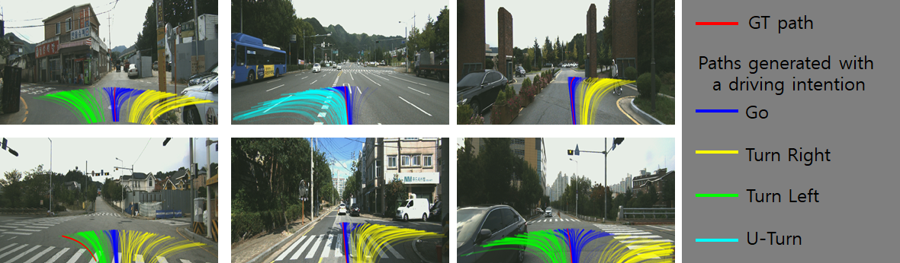

# Official implementation codes for the paper "PathGAN: Local Path Planning with Generative Adversarial Networks"



Our path generation model is designed to generate multiple plausible paths that are consistent with the input driving intention and speed, from egocentric images.

An old version of the paper can be found at https://arxiv.org/abs/2007.03877. An updated version of the paper was submitted to CVPR 2021 and is now under review.  
ETRIDriving, the autonomous driving dataset for the training and the evaluation, can be found at https://github.com/d1024choi/etridriving.

## Preparation
1) DATASET  
    * Create a folder (for example, /home/dooseop/DATASET/) and copy the driving sequences (link) listed in './dataset/train.txt' and './dataset/test.txt' into the created folder.    
    * Copy 'preprocessed_dataset.cpkl' (link) into './dataset/'.  

2) Pretrained Network Params  
    * Create a folder './pretrained_cnn' and copy 'saved_cnn_exp12_model70.pt' (link) into the created folder.  

3) Libraries
    * python 3.6  
    * pytorch 1.1.0  
    * torchvision 0.3.0  
    * opencv 3.1 >=  
    * scipy 1.3.0 >=  
    * scikit-image 0.14 >=
    * scikit-learn 0.22 >=  
  
## Train New Models
To train the model from scratch, run the following. The parameters of the trained networks will be stored in './saved_models/model100'.
```sh
$ python train.py --exp_id 100
```

To evaluate the trained model, run the following.
```sh
$ python eval.py --exp_id 100
```

To draw 300 paths generated by the pretrained model (for example, 'saved_chk_point_95.pt') on the frontview images, run the following.
```sh
$ python visualization.py --exp_id 100 --model_num 95 --besk_k 300
```

## Pretrained Models
Download the pre-trained models from (link) and copy them into './saved_models/'.  
